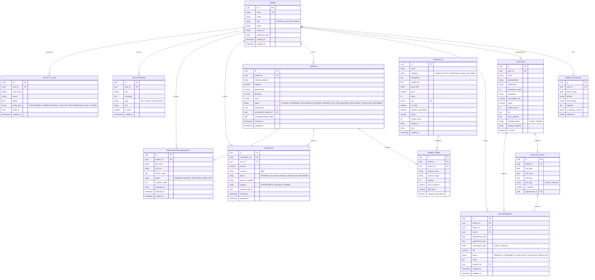

# Entity-Relationship Diagram (ERD) — MediCare Platform

This document presents the relational database schema planned for production migration from LocalStorage to PostgreSQL / MySQL.

```mermaid
erDiagram
    USERS ||--o| PATIENT_PROFILES : has
    USERS ||--o| DOCTORS : "represented as"
    USERS ||--o{ APPOINTMENTS : books
    USERS ||--o{ ORDERS : places
    USERS ||--o{ PAYMENTS : initiates
    USERS ||--o{ PRESCRIPTION_REQUESTS : uploads
    USERS ||--o{ NOTIFICATIONS : receives
    USERS ||--o{ ACTIVITY_LOGS : generates

    DOCTORS ||--o{ DOCTOR_SLOTS : schedules
    DOCTORS ||--o{ APPOINTMENTS : conducts

    DOCTOR_SLOTS ||--o| APPOINTMENTS : reserves

    ORDERS ||--|{ ORDER_ITEMS : contains
    ORDERS ||--o| PAYMENTS : "paid via"
    ORDERS ||--o| PRESCRIPTION_REQUESTS : verifies

    PRODUCTS ||--o{ ORDER_ITEMS : snapshots

    USERS {
        uuid id PK
        string email UK
        string name
        string role "PATIENT | DOCTOR | ADMIN"
        string phone
        string avatar_url
        string password_hash
        timestamp created_at
        timestamp updated_at
    }

    PATIENT_PROFILES {
        uuid id PK
        uuid user_id FK
        date date_of_birth
        string gender
        string blood_group
        text allergies
        jsonb emergency_contact
        jsonb addresses
    }

    DOCTORS {
        uuid id PK
        uuid user_id FK
        string name
        string specialization
        string qualification
        int experience_years
        string languages
        numeric consultation_fee
        numeric rating
        int review_count
        text bio
        text clinic_address
        string available_types "CLINIC, ONLINE"
        jsonb weekly_schedule
        boolean is_active
    }

    DOCTOR_SLOTS {
        uuid id PK
        uuid doctor_id FK
        date slot_date
        time start_time
        time end_time
        string slot_type "CLINIC | ONLINE"
        boolean is_booked
        uuid appointment_id FK
    }

    APPOINTMENTS {
        uuid id PK
        uuid patient_id FK
        uuid doctor_id FK
        uuid slot_id FK
        date appointment_date
        time appointment_time
        string consultation_type "CLINIC | ONLINE"
        numeric fee
        string status "PENDING | CONFIRMED | COMPLETED | CANCELLED | REJECTED"
        text notes
        uuid payment_id FK
        timestamp created_at
        timestamp updated_at
    }

    PRODUCTS {
        uuid id PK
        string name
        string category "wellness | first-aid | monitoring | hygiene | prescription"
        text description
        text usage_info
        string pack_size
        numeric price
        int stock
        string sku UK
        boolean is_active
        boolean requires_prescription
        numeric rating
        int review_count
        string image_url
        string tags
        timestamp created_at
    }

    ORDERS {
        uuid id PK
        uuid patient_id FK
        jsonb shipping_address
        numeric subtotal
        numeric delivery_fee
        numeric discount
        numeric total
        string status "PLACED | CONFIRMED | PROCESSING | PACKED | SHIPPED | OUT_FOR_DELIVERY | DELIVERED | CANCELLED | REFUNDED"
        uuid payment_id FK
        uuid prescription_request_id FK
        date estimated_delivery_date
        timestamp created_at
        timestamp updated_at
    }

    ORDER_ITEMS {
        uuid id PK
        uuid order_id FK
        uuid product_id FK
        string product_name
        string product_image
        int quantity
        numeric price_snapshot
        numeric total_price
        boolean requires_prescription
    }

    PAYMENTS {
        uuid id PK
        string transaction_ref UK
        uuid user_id FK
        numeric amount
        string currency "INR"
        string status "PENDING | SUCCESS | FAILED | CANCELLED | REFUNDED"
        string payment_method
        string purpose "APPOINTMENT | PRODUCT_ORDER"
        uuid related_entity_id
        timestamp created_at
        timestamp updated_at
    }

    PRESCRIPTION_REQUESTS {
        uuid id PK
        uuid patient_id FK
        string file_name
        string file_size
        text doctor_notes
        string status "PENDING_REVIEW | APPROVED | REJECTED"
        text reviewer_notes
        string reviewed_by
        timestamp reviewed_at
        timestamp created_at
    }

    NOTIFICATIONS {
        uuid id PK
        uuid user_id FK
        string title
        text message
        string type "info | success | warning | error"
        string link
        boolean is_read
        timestamp created_at
    }

    ACTIVITY_LOGS {
        uuid id PK
        uuid user_id FK
        string user_name
        string action
        text details
        string entity_type "APPOINTMENT | ORDER | PRODUCT | DOCTOR | PRESCRIPTION | USER | SYSTEM"
        uuid entity_id
        timestamp created_at
    }
```

